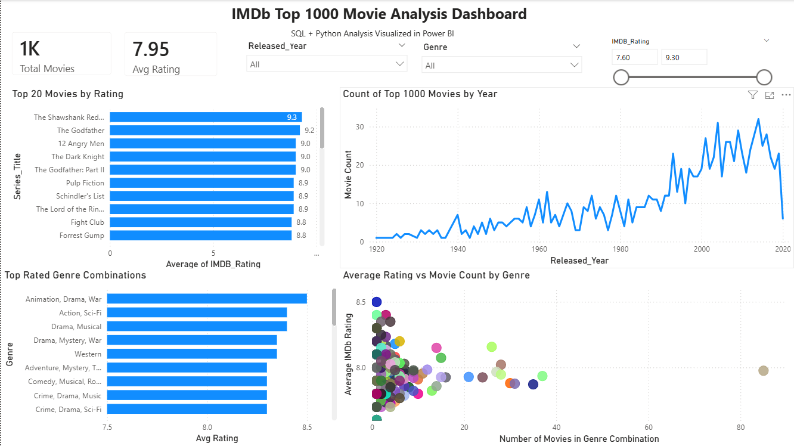

# IMDb Top 1000 Movie Analysis

## Overview
An end-to-end analysis of the IMDb Top 1000 dataset exploring trends in movie ratings, 
genres, and release years using SQL, Python, and Power BI.

## Dataset
- **Source:** [Kaggle — IMDb Top 1000](https://www.kaggle.com/datasets/harshitshankhdhar/imdb-dataset-of-top-1000-movies-and-tv-shows)
- **Fields:** Title, Genre, IMDB Rating, Director, Gross Revenue, Release Year, Runtime

## Tools Used
- **SQL** - Data cleaning and exploratory analysis
- **Python** - Statistical analysis and additional exploration
- **Power BI** - Interactive dashboard with filters and KPIs

## Key Insights
- Drama-based genre combinations tend to achieve the highest average ratings
- The early 2000s–2010s show the highest concentration of top-rated films
- Less common genre combinations often outperform popular genres in average rating

## Files
- [`IMDB Top 1000 Exploratory Data Analysis (SQL + Python).pdf`](https://drive.google.com/file/d/15PfZVEFTMnTtQTyjF0y61M4N5lxFzhoF/view?usp=sharing) - Full analysis
- [`IMDb Top 1000 Movie Analysis Dashboard.pbix`](https://drive.google.com/file/d/1jQ8QC7niYzca3XAR5AJb3CV_zhcVbLbq/view?usp=sharing) - Power BI dashboard
- 
## Dashboard Preview

